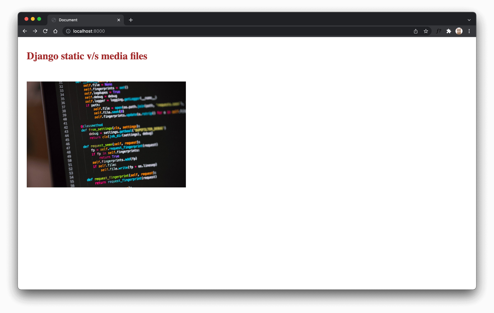

# Django static v/s media files

This article looks at the different kinds of files usually included in a Django project and how to manage them.

## Objectives

By the end of this article, you should be able to:

1. Know the different kinds of files used in a Django project
1. Using static files (or static assets) in a development environment
1. Using static files (or static assets) in a production environment
1. Uploading files in Django (media files)

Django is a full-stack framework. It comes with many batteries that you can use to build a fully functional web application.  Django also lets you work with files with ease. These files could be of three types.

## Three types of files in a Django application

- Source code: The heart of any Django application. The definition for models, views, and templates is found here.
- Static files: Any file part of your application, like an image or a CSS file.
- Media file: Any file that the user uploads is called a media file.

We will be focussing on static and media files in this article. Even though the names are different, both represent regular files. Now you may wonder, why separate them into different categories. It's done for the following reasons.

- You cannot trust the file uploaded by the user. So they have to be treated differently.
- Sometimes, you need to perform processing on files so that they can be better served(For example, you could optimize the user-uploaded images to support different devices)
- You don't want a user uploaded file to replace a static file accidentally.

## Serving Static Files in a development environment

Before proceeding, let's create a basic Django application.

```bash
# Create and activate a virtual environment
virtualenv .venv
source .venv/bin/activate

# Install Django
pip install django==3.2.10

# Create a new Django project
django-admin startproject config .

# Run Django migrations
python manage.py migrate
```

Now that our development setup is ready, let's see how we can serve static files in the development mode. We will be serving a `CSS` file and an `image` file.

Create a new folder named `static` at the root of the project and copy [base.css] and [python.jpg] to it.

```shell
(.venv) ➜ ls static
base.css   python.jpg
```

Django's [staticfiles](https://docs.djangoproject.com/en/3.2/ref/contrib/staticfiles/) app helps us serve static files in development as well as in the production environment.

> django.contrib.staticfiles collects static files from each of your applications (and any other places you specify) into a single location that can easily be served in production. - Django docs

Here are some essential staticfiles parameters that you should take care of:

- [STATIC_URL](https://docs.djangoproject.com/en/3.2/ref/settings/#static-url): URL where your static files can be accessed. Default is `/static/`.

- [STATIC_ROOT](https://docs.djangoproject.com/en/3.2/ref/settings/#static-root): Location where [collectstatic](https://docs.djangoproject.com/en/3.2/ref/contrib/staticfiles/#django-admin-collectstatic) will collect all the static files. Collectstatic is a management command that collects static files from `STATIC_ROOT`.

- [STATICFILES_DIRS](https://docs.djangoproject.com/en/3.2/ref/settings/#staticfiles-dirs): Additional locations to look for static files.

- [STATICFILES_STORAGE](https://docs.djangoproject.com/en/3.2/ref/settings/#staticfiles-storage): Storage for your static files. By default, the files are stored in the file system. You can change the storage to [cloud storage or a CDN](https://docs.djangoproject.com/en/3.2/howto/static-files/deployment/#serving-static-files-from-a-cloud-service-or-cdn).

Now that we have seen the essential parameters to handle static files let's see them in action.

Create a new folder `templates` at the root of the project. This directory will hold all our Django templates. Then, update the `settings.py` for the same.

```python
# config/settings.py

TEMPLATES = [
    {   
        ...
        "DIRS": [BASE_DIR / "templates"],
        ...
    },
]

STATICFILES_DIRS = [
    BASE_DIR / "static", # new
]

```

Now, create the `_base.html` under the templates directory.

```html
<!-- templates/_base.html -->



<!DOCTYPE html>
<html lang="en">
<head>
    <meta charset="UTF-8">
    <meta http-equiv="X-UA-Compatible" content="IE=edge">
    <meta name="viewport" content="width=device-width, initial-scale=1.0">
    <title>Document</title>
    <link rel="stylesheet" href="">
</head>
<body>
    
    
</body>
</html>
```

Notice that we have added a line: `` and used a similar tag to point to our `base.css` file. The former allows us to use static templatetags, and the latter will automatically point to the file under the `static` directory. Moreover, the tag will generate a complete URL like, `/static/base.css`. This tag comes in handy when deciding to change the `STATIC_URL` in a vast project. In such situations, the URL change is handled by Django automatically.

Next, create the `index.html` file.

```html
<!-- templates/index.html -->






<h1>Django static v/s media files</h1>



```

We use the same templatetag to load the image file as well.

We need to create a simple view to render our template. For now, let's add the view to the `config/urls.py` file. We will move this view into an app in a later section.

```python
# config/urls.py

from django.contrib import admin
from django.urls import path
from django.views.generic import TemplateView # new

urlpatterns = [
    path("admin/", admin.site.urls),
    path("", TemplateView.as_view(template_name="index.html"), name="home"), # new
]
```

Run the server: `python manage.py runserver` and navigate to [http://localhost:8000](http://localhost:8000) to test our application.



## Serving Static Files in a production environment

Serving static files in a development environment was pretty straightforward. We use the `static` templatetag to load the file into the template. However, we need to do more configuration for production because production would require a production-grade server like [gunicorn](https://gunicorn.org/) that does not serve static files.

We can use [whitenoise](http://whitenoise.evans.io/en/stable/) to serve static files from our production application.

Install whitenoise and gunicorn(for) testing the static files on a production server:

```shell
(.venv) ➜ pip install 'whitenoise[brotli]'==5.3.0 gunicorn==20.1.0
```

We will use whitenoise with the newer, more efficient [brotli](https://en.wikipedia.org/wiki/Brotli) format.

Once installed, add the following to the Django settings file:

```python
# config/settings.py

STATIC_ROOT = BASE_DIR / 'staticfiles'
STATICFILES_STORAGE = 'whitenoise.storage.CompressedStaticFilesStorage'
```

The `STATIC_ROOT` will host all the collected static files (when using `collectstatic`), and the `STATICFILES_STORAGE` will compress our static files. If you want to cache as well, replace `STATICFILES_STORAGE` with,

```python
STATICFILES_STORAGE = 'whitenoise.storage.CompressedManifestStaticFilesStorage'
```

Finally, add whitenoise's middleware above all others, but after Django's [SecurityMiddleware](https://docs.djangoproject.com/en/stable/ref/middleware/#module-django.middleware.security):

```python
# config/settings.py

MIDDLEWARE = [
  'django.middleware.security.SecurityMiddleware',
  'whitenoise.middleware.WhiteNoiseMiddleware',
  ...
]
```

Run `python manage.py collectstatic` to collect and compress all static files. The command should create a new folder named `staticfiles` in your root directory.

```shell
(.venv) ➜  ls -l staticfiles
total 11912
...
-rw-r--r--  1 admin  staff   103 Dec 12 18:40 base.css
-rw-r--r--  1 admin  staff    63 Dec 12 18:40 base.css.br
-rw-r--r--  1 admin  staff    91 Dec 12 18:40 base.css.gz
...
```

Compare the sizes of the original file (`base.css`) and brotli compressed (`base.css.br`).

Run the gunicorn server and navigate to [http://localhost:8000](http://localhost:8000):

```shell
(.venv) ➜ gunicorn config.wsgi --log-level DEBUG
```

## Handling media files in development

Two essential options for handling media files are:

- MEDIA_URL: Similar to static URL, the URL where media files can be accessed.

- MEDIA_ROOT: Location where all media files are stored.

We will use the `uploads` folder in the root directory to store uploaded files.

```python
# config/settings.py

MEDIA_URL = "/media/"
MEDIA_ROOT = BASE_DIR / "uploads"
```

Let's create a new Django application:

```shell
(.venv) ➜ python manage.py startapp userprofile
```

Add the created app to `INSTALLED_APPS`.

```python
# config/settings.py

INSTALLED_APPS = [
    ...
    "userprofile.apps.UserprofileConfig",
]
```

Let's create a tiny model and form to upload files to our Django application.

```python
# userprofile/models.py

from django.db import models

class Profile(models.Model):
    image = models.FileField()
```

Run the migrations to create the Profile table:

```shell
(.venv) ➜ python manage.py makemigrations userprofile
(.venv) ➜ python manage.py migrate
```

Next, we create a form to handle the upload. Instead of creating a custom field, you can always use the `forms.ModelForm`.

```python
# userprofile/forms.py
from django import forms

class UploadForm(forms.Form):
    image = forms.FileField(label="Upload a picture")
```

Next, we create a view to upload and render the uploaded images.

```python
# userprofile/views.py

from django.shortcuts import render
from .forms import UploadForm
from .models import Profile
from django.http.request import HttpRequest
from django.http.response import HttpResponse


def profile(request: HttpRequest):
    if request.method == "POST":
        form = UploadForm(request.POST, request.FILES)
        if form.is_valid():
            profile = Profile(image=request.FILES["image"])
            profile.save()
            return render(request, "profile.html", {"profile": profile})
        else:
            return HttpResponse("Image upload failed")
    form = UploadForm()
    return render(request, "profile.html", {"form": form})
```

The view validates the uploaded image, saves it to our model, and returns the created profile to display on the template.

Let's create the corresponding template:

```html
<!-- templates/profile.html -->





<h1>Django static v/s media files</h1>


<form method="POST" enctype="multipart/form-data">
    
    {{form.as_p}}
    <button type="submit">upload</button>
</form>







```

Django's development server is not capable of serving media files. So we need to add the media URL as a static path.

```python
# config/urls.py

...
from django.conf.urls.static import static
from django.conf import settings

urlpatterns = [
    path("admin/", admin.site.urls),
    path("", TemplateView.as_view(template_name="index.html"), name="home"),
    path("", include("userprofile.urls")),
]

if settings.DEBUG: # new
    urlpatterns += static(settings.MEDIA_URL, document_root=settings.MEDIA_ROOT)
```

Restart the server and checkout the upload form at [http://localhost:8000/profile/](http://localhost:8000/profile/). Check out the `uploads` folder; Django will automatically make the uploaded file's name unique.

## Handling media files in production

Using external storage with a good CDN is recommended for handling media files in production. [Django-storages](https://django-storages.readthedocs.io/en/latest/) supports S3, Google Cloud Storage, and other cloud storage providers. Django-storages can be used to store static files as well.

Check out these resources to learn how to manage static and media files(private & public)

- s3: [https://testdriven.io/blog/storing-django-static-and-media-files-on-amazon-s3/](https://testdriven.io/blog/storing-django-static-and-media-files-on-amazon-s3/)

- DigitalOcean Spaces: [https://testdriven.io/blog/django-digitalocean-spaces/](https://testdriven.io/blog/django-digitalocean-spaces/)
