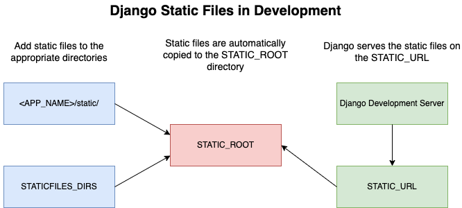

# Django static v/s media files

Potential titles

1. Working with Static and Media Files in Django
1. Managing Static and Media Files in Django
1. Working with Django Static and Media Files
1. Managing Django Static and Media Files
1. Django Static and Media Files
1. Static and Media Files in Django
1. Static vs Media Files in Django
1. Django Static vs Media Files

TODO: which title do you like?

This articles looks at how to work with static and media files in a Django project, locally and in production.

## Objectives

By the end of this article, you will be able to:

1. Describe the three different types of files that you'll usually find in a Django project
1. Explain the difference between static and media files
1. Work with both static and media files locally and in production

## Types of Files

Django is an opinionated, full-stack web application framework. It comes with many [batteries](https://docs.djangoproject.com/en/4.0/ref/contrib/) that you can use to build a fully functional web application, including static and media file management.

Before we look at the *how*, let's start with some definitions.

*What are static and media files?*

First off, you'll typically find these three types of files in a Django project:

1. **Source code**: These are your core Python modules and HTML files, that make up every Django project, where you define your models, views, and templates.
1. **Static files**: These are your CSS stylesheets, JavaScript files, fonts, and images.
1. **Media file**: These are files that a user uploads.

> Static and media files are sometimes referred to as static and media assets.

This article focuses on static and media files. Even though the names are different, both represent regular files. The major difference between them is that static files are kept in version control and shipped with your source code files during deployment.

> The Django admin comes with some static files, which are stored in version control on [GitHub](https://github.com/django/django/tree/main/django/contrib/admin/static/admin).

Media files, on the other hand, are files that your end users (internally and externally) upload or are dynamically created by your application (often as a side effect of some user action).

> Adding to the confusion between static and media files is that the Django documentation itself doesn't do a great job differentiating between the two.

*Why should you treat static and media files differently?*

1. You can't trust files uploaded by end users, so they need to be treated differently.
1. Sometimes you need to perform processing on files so that they can be better served -- e.g, you could optimize the user-uploaded images to support different devices.
1. You don't want a user uploaded file to replace a static file accidentally.

## Static Files

Django provides a powerful battery for working with static files, aptly named [staticfiles](https://docs.djangoproject.com/en/4.0/ref/contrib/staticfiles/).

If you're new to the staticfiles app, take a quick look at the [How to manage static files (e.g. images, JavaScript, CSS)](https://docs.djangoproject.com/en/4.0/howto/static-files/) guide from the Django documentation.

Django's staticfiles app provides the following core components:

1. Settings
1. Management Commands
1. Storage Classes
1. Template Tags

### Settings

There are a number of [settings](https://docs.djangoproject.com/en/4.0/ref/settings/#settings-staticfiles) that you *may* need to configure, depending on your environment:

1. [STATIC_URL](https://docs.djangoproject.com/en/4.0/ref/settings/#static-url): The URL where the user can access your static files from in the browser. The default is `/static/`, which means your files will be available at `http://127.0.0.1:8000/static/` in development mode -- e.g.,  `http://127.0.0.1:8000/static/css/main.css`.
1. [STATIC_ROOT](https://docs.djangoproject.com/en/4.0/ref/settings/#static-root): The absolute path to the directory to the directory where your Django application will serve your static files from. When you run the [collectstatic](https://docs.djangoproject.com/en/4.0/ref/contrib/staticfiles/#django-admin-collectstatic) management command (more on this shortly), it will find all static files and copy them into this directory.
1. [STATICFILES_DIRS](https://docs.djangoproject.com/en/4.0/ref/settings/#staticfiles-dirs): By default, static files are stored at the app-level at `<APP_NAME>/static/`. The collectstatic command will look for static files in those directories. You can also tell Django to look for static files in additional locations via the `STATICFILES_DIRS` setting.
1. [STATICFILES_STORAGE](https://docs.djangoproject.com/en/4.0/ref/settings/#staticfiles-storage): The file storage class you'd like to use, which Controls how the static files are stored and accessed. By default, the files are stored in the file system via [StaticFilesStorage](https://docs.djangoproject.com/en/4.0/ref/contrib/staticfiles/#staticfilesstorage).
1. [STATICFILES_FINDERS](https://docs.djangoproject.com/en/4.0/ref/settings/#std:setting-STATICFILES_FINDERS): TODO

### Management Commands

The staticfiles apps provides these [management commands](https://docs.djangoproject.com/en/4.0/ref/contrib/staticfiles/#management-commands):

1. Collectstatic is a management command that collects static files from the various locations -- i.e., `<APP_NAME>/static/` and the directories found in the `STATICFILES_DIRS` setting -- and copies them to the `STATIC_ROOT` directory.
1. findstatic - this is a really helpful command to use when debugging so you can see exactly where a specific file comes from
1. runserver - TODO

TODO: want to show a quick example of how to use the findstatic command? (create two django apps and add a main.css file to each of the static folders inside, configure the STATIC_ROOT, run collectstatic, look at the STATIC_ROOT in the filesystem and then use findstatic to find where each comes from)

> Don't put any static files in the `STATIC_ROOT` directory. That's where the static files get copied to automatically after you run `collectstatic`. Always put them in the directories associated with the `STATICFILES_DIRS` setting or `<APP_NAME>/static/`.

### Storage Classes

TODO

You can change the storage to [cloud storage or a CDN](https://docs.djangoproject.com/en/4.0/howto/static-files/deployment/#serving-static-files-from-a-cloud-service-or-cdn).

### Template Tags

Example:

```html
<!-- templates/_base.html -->



<!DOCTYPE html>
<html lang="en">
<head>
    <meta charset="UTF-8">
    <meta http-equiv="X-UA-Compatible" content="IE=edge">
    <meta name="viewport" content="width=device-width, initial-scale=1.0">
    <title>Document</title>
    <link rel="stylesheet" href="">
</head>
<body>
    
    
</body>
</html>
```

https://github.com/testdrivenio/django-static-media-files/blob/draft/templates/_base.html

Notice that we have added a line: `` and used a similar tag to point to our `base.css` file. The former allows us to use static templatetags, and the latter will automatically point to the file under the `static` directory. Moreover, the tag will generate a complete URL like `/static/base.css`. This tag comes in handy when deciding to change the `STATIC_URL` in a vast project. In such situations, the URL change is handled by Django automatically.

The same approach can be used wherever we need to access the static file: https://github.com/testdrivenio/django-static-media-files/blob/draft/templates/index.html.

## Static Files in Development Mode

During development, as long as you have `DEBUG` set to `TRUE` and you're using the static files app, you can serve up static files using Django's development server. You don't even need to run the collecstatic command.

Typical development config:

```python
# settings.py
STATIC_URL = "/static/"
STATIC_ROOT = BASE_DIR / "staticfiles"
STATICFILES_DIRS = [BASE_DIR / "static",]
STATICFILES_STORAGE = "django.contrib.staticfiles.storage.StaticFilesStorage"
```

Check the `settings.py` file to see the settings: https://github.com/testdrivenio/django-static-media-files/blob/21ac2562d1cfcd459629e7c484bcdd2e09defa13/config/settings.py#L123-L126.

TODO: thoughts on this image? should i make one for production as well?



## Static Files in Production

https://docs.djangoproject.com/en/4.0/howto/static-files/deployment/

Production isn't quite as easy since you'll be using a WSGI-compatible web application server, like [Gunicorn](https://gunicorn.org/), which is used to serve up the dynamic content -- i.e., your Django source code files.

Options:

1. Nginx - point the config to the static root STATIC_ROOT
1. WhiteNoise

(Regardless of the option, use a CDN)

### Nginx

TODO: show typical Nginx config

TODO: S3 is an option here. add brief note and then link to the Django Static Files S3 article

### WhiteNoise

We can use [whitenoise](http://whitenoise.evans.io/en/stable/) to serve static files from our production application. However, it is recommended to use whitenoise with the newer, more efficient [brotli](https://en.wikipedia.org/wiki/Brotli) format.

Here's our updated configuration for handling static files in production: https://github.com/testdrivenio/django-static-media-files/blob/21ac2562d1cfcd459629e7c484bcdd2e09defa13/config/settings.py#L123-L128

The `STATIC_ROOT` will host all the collected static files (when using `collectstatic`), and the `STATICFILES_STORAGE` will compress our static files. If you want to cache as well, replace `STATICFILES_STORAGE` with,

```python
STATICFILES_STORAGE = 'whitenoise.storage.CompressedManifestStaticFilesStorage'
```

Running the `collectstatic` command creates the compressed files for the static ones.

```shell
(.venv) ➜  ls -l staticfiles
total 11912
...
-rw-r--r--  1 admin  staff   103 Dec 12 18:40 base.css
-rw-r--r--  1 admin  staff    63 Dec 12 18:40 base.css.br
-rw-r--r--  1 admin  staff    91 Dec 12 18:40 base.css.gz
...
```

Compare the sizes of the original file (`base.css`) and brotli compressed (`base.css.br`). The compressed file can be served faster via a CDN (due to its small size) and quickly decompressed in the browser.

## Media Files

https://docs.djangoproject.com/en/4.0/topics/files/

Two essential configuration settings for handling media files are:

- MEDIA_URL: Similar to the `STATIC_URL`, this is the URL where users can access media files.
- MEDIA_ROOT: Location where all media files are stored.
- DEFAULT_FILE_STORAGE: TODO

## Media Files in Development Mode

For the media files example, we have created a new app, `userprofile` with a [tiny model](https://github.com/testdrivenio/django-static-media-files/blob/draft/userprofile/models.py) and [a form](https://github.com/testdrivenio/django-static-media-files/blob/draft/userprofile/forms.py) to handle the file uploads.

```python
# userprofile/models.py

from django.db import models

class Profile(models.Model):
    image = models.FileField()
```

```python
# userprofile/forms.py
from django import forms

class UploadForm(forms.Form):
    image = forms.FileField(label="Upload a picture")
```

For handling the file uploads, we have a function-based view that will get the uploaded image, then Django will process it, save it in the appropriate directory, and send back the image in the same template.

```python
# userprofile/views.py

from django.shortcuts import render
from .forms import UploadForm
from .models import Profile
from django.http.request import HttpRequest
from django.http.response import HttpResponse


def profile(request: HttpRequest):
    if request.method == "POST":
        form = UploadForm(request.POST, request.FILES)
        if form.is_valid():
            profile = Profile(image=request.FILES["image"])
            profile.save()
            return render(request, "profile.html", {"profile": profile})
        else:
            return HttpResponse("Image upload failed")
    form = UploadForm()
    return render(request, "profile.html", {"form": form})
```

We won't be using the static tag for media files as done in the case of static files. The uploaded file URL can be obtained directly from the `profile` object created. https://github.com/testdrivenio/django-static-media-files/blob/21ac2562d1cfcd459629e7c484bcdd2e09defa13/templates/profile.html#L14-L16

Django's development server is not capable of serving media files. A workaround is to add the media root as a static path. https://github.com/testdrivenio/django-static-media-files/blob/21ac2562d1cfcd459629e7c484bcdd2e09defa13/config/urls.py#L28-L29

Clone and run the application to see both static and media files in development. Django will take care of the naming (in case multiple uploads have the same name).

Key to serving media files in development is adding the following to the *urls.py* file:

```python
if settings.DEBUG:
    urlpatterns += static(settings.MEDIA_URL, document_root=settings.MEDIA_ROOT)
```

## Media Files in Production

Using external storage with a good CDN is recommended for handling media files in production. [Django-storages](https://django-storages.readthedocs.io/en/latest/) supports S3, Google Cloud Storage, and other cloud storage providers. Django-storages can be used to store static files as well.

Check out these resources to learn how to manage static and media files. The posts also cover the private handling of media files.

- s3: [https://testdriven.io/blog/storing-django-static-and-media-files-on-amazon-s3/](https://testdriven.io/blog/storing-django-static-and-media-files-on-amazon-s3/)

- DigitalOcean Spaces: [https://testdriven.io/blog/django-digitalocean-spaces/](https://testdriven.io/blog/django-digitalocean-spaces/)

## Conclusion

Static and media files are different and must be treated differently for security purposes.

In this article, you saw examples of how to serve static files in development and production. In addition, the article also covered:

1. The different settings for both types of files
1. How Django handles them with minimal configuration
1. hHw to serve static and media files in development and production

You can find the example project on GitHub: https://github.com/testdrivenio/django-static-media-files.

TODO: Add a note about the fact that we really only covered the serving of static and media files in this article. With modern web development, there may be complex build processes where you bundle and minify your static files with a tool like webpack.
